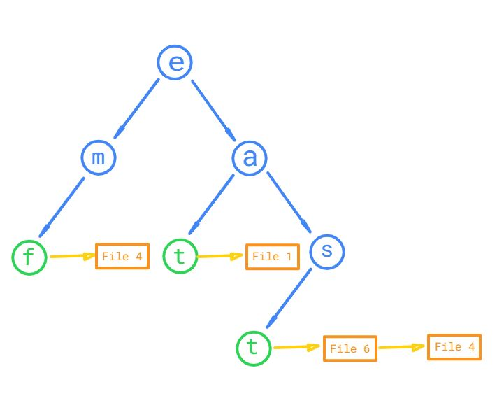

# File-Ranking-On-Linux-Platform
### Used Trie Data Structure and Linked List to fetch relavant file names according to a given string.

- As you can see there are 3 words in trie, 'emf','eat' and 'east'. Green color is a flag denoting it's the end of a word.
- And to each flag there is a Linked List associated with it denoting file name in which the word is present.
- We used [TF-IDF](https://en.wikipedia.org/wiki/Tf%E2%80%93idf) algorithm to find the best matching file on top.
